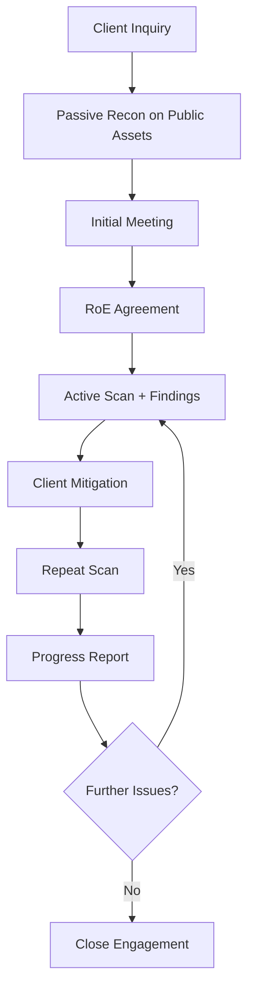

# 🛡️ Cyber Care — Workflow

Welcome to the Cyber Care Rules of Engagement. This document defines how we deliver cybersecurity ethically, transparently, and collaboratively. It protects clients, contributors, and the integrity of the platform.

🔄 Circular Navigation  
Cyber Care documentation is designed with circular references to ensure contributors can enter from any file and still reach the full model context. This supports ethical onboarding, traceability, and modular clarity.

---

## 📌 Purpose

- Define ethical boundaries and consent protocols
- Clarify escalation paths and contributor responsibilities
- Enable traceable, auditable engagement cycles
- Empower clients to demonstrate reasonable security effort

---

## 🧭 Engagement Principles

1. **Consent First**  
   - No privileged or active actions without explicit client consent  
   - Consent must be documented and revocable at any time

2. **Empathy Always**  
   - Use plain English, analogies, and reassurance  
   - Avoid jargon, fear-based language, or coercive framing

3. **Transparency by Default**  
   - All actions logged with VC metadata blocks  
   - AI involvement and automation limits disclosed clearly

4. **Privilege-Aware Execution**  
   - No elevation without documented justification and client approval  
   - Scripts must respect user boundaries and traceability

---

## 🚦 Engagement Flow

---

## 🧪 Passive Reconnaissance (Pre-RoE)

Cyber Care may perform **non-invasive scans** on public-facing assets after a client inquiry but before the initial meeting. This helps tailor the conversation and demonstrate value.

**Examples:**
- DNS enumeration  
- SSL/TLS configuration checks  
- Public breach exposure  
- Open port visibility

**Safeguards:**
- No authentication or intrusive probing  
- Results shared transparently  
- Framed as a conversation starter, not a commitment

---

## 🔐 Consent Boundaries

| Action Type            | Requires Consent | Notes |
|------------------------|------------------|-------|
| Passive diagnostics    | ❌ No (if public) | Used to guide initial meeting |
| Active scans           | ✅ Yes            | Scope must be understood |
| Remediation scripts    | ✅ Yes            | Approval logged with VC block |
| Data export/sharing    | ✅ Yes            | Requires written consent |
| AI-assisted summaries  | ⚠️ Optional       | Disclose AI involvement clearly |

---

## 🚨 Escalation Protocols

If a contributor encounters:
- Suspicious activity  
- Client distress or confusion  
- Ethical ambiguity or unclear consent  

They must:
1. Pause all actions  
2. Log the event with VC metadata  
3. Notify the escalation lead  
4. Await guidance before proceeding

---

## 🔁 Post-Mitigation Verification Loop

After remediation, Cyber Care supports a **repeat scan** to:
- Confirm mitigation success  
- Validate client or contributor actions  
- Provide updated findings  
- Determine if further cycles are needed

**Ethical framing:**
- Non-punitive and collaborative  
- Encourages client self-mitigation  
- All repeat scans logged and versioned

---

## ✅ Demonstrating Reasonable Effort

Cyber Care helps clients show they’ve taken **reasonable steps** to secure their systems—critical for:
- Legal defensibility  
- Insurance compliance  
- Stakeholder trust

**Progress is tracked via:**
- VC metadata blocks  
- Mitigation logs  
- Repeat scan comparisons  
- Timestamped reports

---

## 🧾 Version Control & Amendments

This document is version-controlled. Contributors may suggest edits via pull requests. All changes must:
- Preserve ethical clarity  
- Maintain traceability  
- Be reviewed by the Cyber Care stewardship team.
- Example [Version Control](./vc-log.md) document used for this project

